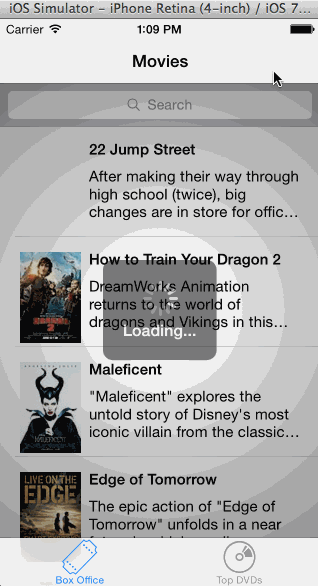

iOSRottenTomatoes
=================

An app like Rotten tomatoes using the Rotten Tomatoes API

Total time taken: 12 hours

User Stories Done:

- User can view a list of movies from Rotten Tomatoes.  Poster images must be loading asynchronously. 
- User can view movie details by tapping on a cell 
- User sees loading state while waiting for movies API.  You can use one of the 3rd party libraries here. 
- User sees error message when there's a networking error.  You may not use UIAlertView to display the error.  See this screenshot for what the error message should look like: network error screenshot. 
- User can pull to refresh the movie list. 
- Add a tab bar for Box Office and DVD. (optional) 
- Add a search bar. (optional)
- All images fade in (optional)

Additional Requirements Done:

- Must use Cocoapods.
- Asynchronous image downloading must be implemented using the UIImageView category in the AFNetworking library. 

