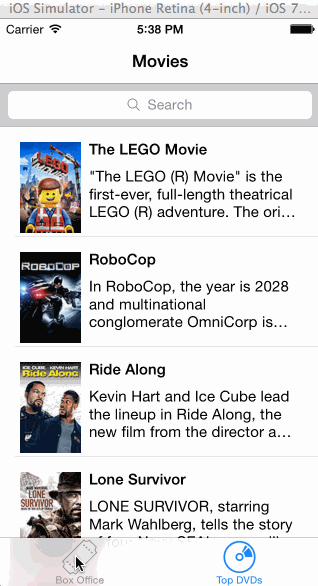

iOSRottenTomatoes
=================

An app like Rotten tomatoes using the Rotten Tomatoes API

User Stories:

- User can view a list of movies from Rotten Tomatoes.  Poster images must be loading asynchronously. [DONE]
- User can view movie details by tapping on a cell [DONE]
- User sees loading state while waiting for movies API.  You can use one of the 3rd party libraries here. [DONE]
- User sees error message when there's a networking error.  You may not use UIAlertView to display the error.  See this screenshot for what the error message should look like: network error screenshot. [DONE]
- Add a tab bar for Box Office and DVD. (optional) [DONE]
- User can pull to refresh the movie list. [DONE]

Not Done:

- All images fade in (optional) 
- For the large poster, load the low-res image first, switch to high-res when complete (optional)
- All images should be cached in memory and disk. In other words, images load immediately upon cold start (optional).
- Customize the highlight and selection effect of the cell. (optional)
- Customize the navigation bar. (optional)
- Add a search bar. (optional)

Additional Requirements

- Must use Cocoapods. [DONE]
- Asynchronous image downloading must be implemented using the UIImageView category in the AFNetworking library. [DONE]

